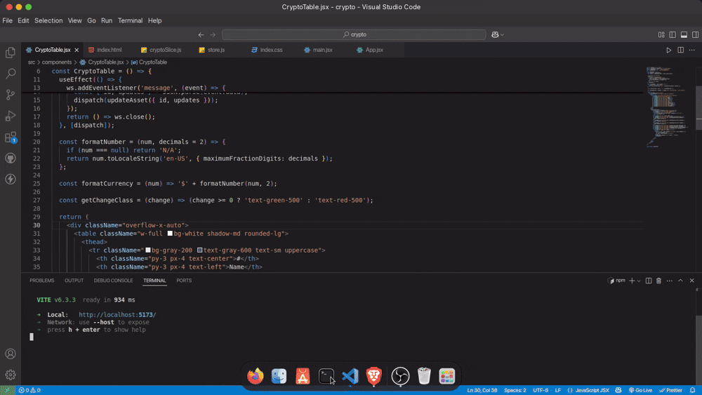

# Crypto Price Tracker

A responsive React + Redux Toolkit application that tracks real-time cryptocurrency prices, simulating WebSocket updates and managing state with Redux.

## Demo


## Tech Stack
- **Frontend**: React
- **State Management**: Redux Toolkit
- **Styling**: Tailwind CSS
- **Simulated WebSocket**: Custom `MockWebSocket` class
- **Build Tool**: Create React App

## Features
- Displays 5 cryptocurrencies (BTC, ETH, USDT, BNB, SOL) in a responsive table.
- Real-time updates for price, % changes, and 24h volume every 1-2 seconds.
- Color-coded percentage changes (green for positive, red for negative).
- Static 7D chart using SVG.
- All state managed via Redux Toolkit with selectors for optimized rendering.

## Architecture
- **Components**: `CryptoTable` handles the table UI and WebSocket integration.
- **Redux**: `cryptoSlice` manages asset data; `store` configures the Redux store.
- **Utils**: `MockWebSocket` simulates real-time updates using `setInterval`.
- **State Flow**: WebSocket dispatches `updateAsset` actions to update Redux state, which triggers UI re-renders via selectors.

## Setup Instructions
1. Clone the repository:
   ```bash
   git clone https://github.com/your-username/crypto-price-tracker.git
   cd crypto-price-tracker

2. Install Dependencies:
   ```bash
   npm install

3. Start the development server:
    ```bash
       nm run dev

4.Open http://localhost:5173 in your browser   
